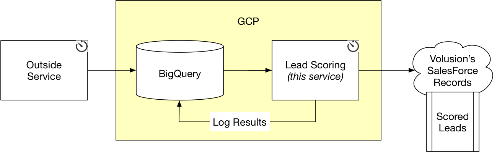

# marketing_lead_scoring

Production service of the marketing leads scoring model.



# Building
```
git clone git@github.com:VolusionDev/marketing_lead_scoring.git
cd affiliation-attribution-service
make build
```

# Running
```
# on AppEngine or env with credentials baked in
ENV=dev make run

# uses your default application credentials to run locally
ENV=dev make run_local
```

# Deploying
```
env=DEV make deploy
```

# Testing
* TODO